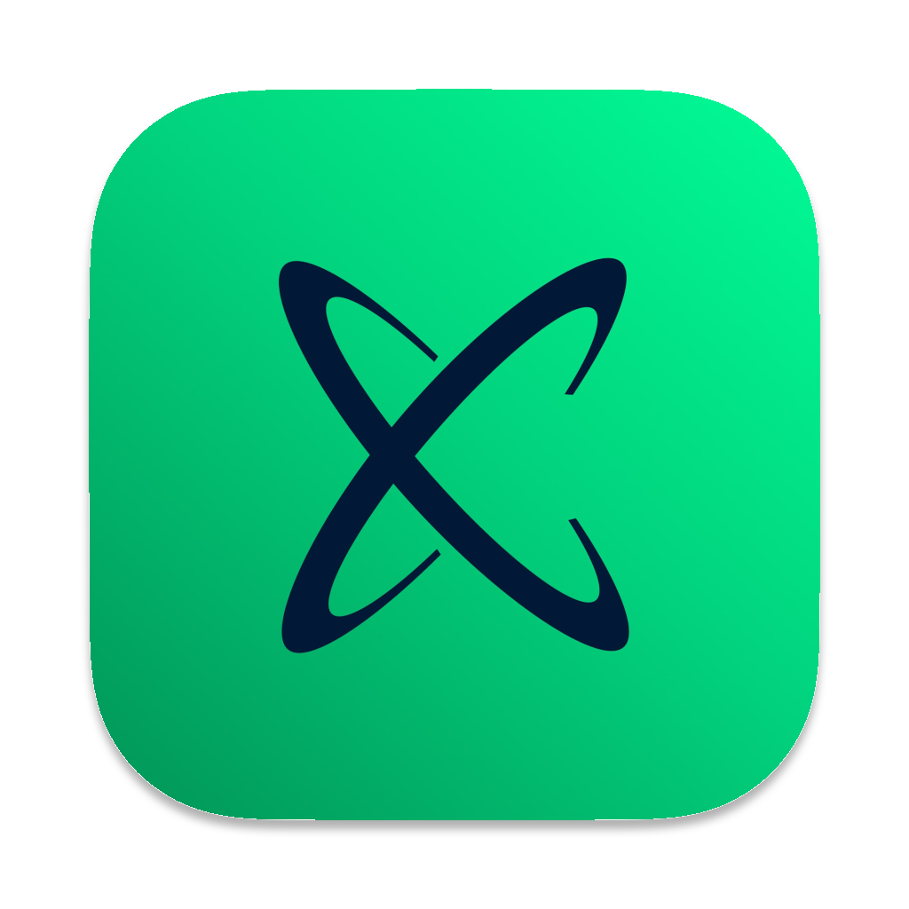

<div align="center">
  

  <h1>DevOps Nexus</h1>
  <p><b>The Ultimate DevOps Workstation & Deployment Hub for Developers</b></p>

  <a href="https://github.com/bootfi-team/nexus-downloads/releases">
    
  </a>
  
  
  
</div>

---

## 🌌 Introduction

**DevOps Nexus** is your all-in-one environment manager and deployment orchestrator. It is designed to get you coding in minutes and deploying in seconds. 

For developers, Nexus removes the friction of server management. You don't need to touch cPanel, SSH into servers, or configure DNS records. Whether you are setting up a brand new machine or pushing a critical hotfix to production, Nexus handles the heavy lifting securely and directly from your local terminal.

---

## ✨ Core Features: What You Gain

Nexus is built to protect your time and your code. Here is what you can do without ever leaving your terminal:

- **🚀 Instant Workstation Setup:** Run the Nexus installer on a fresh Mac or Ubuntu machine, and it automatically installs Homebrew, Git, PHP, Node, Docker, and all your essential desktop apps (Discord, Slack, Warp, etc.). It even configures your ZSH terminal with our signature `antigravity` theme.
- **⚡ Zero-Touch Provisioning:** Need a new testing environment? Nexus provisions the server, creates the databases, configures the `.env` files, and deploys your code automatically. 
- **🛟 Fail-Safe Code Rollbacks:** Broke staging? Don't panic. The `Emergency Rollback` command lets you instantly jump back to the previous stable release with zero downtime.
- **🗄️ Secure Database Backups:** Need a snapshot before running a risky migration? Trigger a secure database dump that automatically zips and sends the file directly to the master Discord channel—keeping sensitive data off your local machine.
- **☁️ One-Click Cloudflare DNS:** Instantly bind your custom domains and activate Cloudflare's proxy (Orange Cloud) to secure your endpoints and enable AutoSSL.
- **📢 Custom Project Alerts:** Easily route deployment success/failure notifications to your project's specific Slack or Discord channels.

---

## 📸 Interface

<div align="center">
  <table>
    <tr>
      <td colspan="2" align="center"><b>Main Orchestrator Menu</b><br>
      </td>
    </tr>
    <tr>
      <td align="center"><b>Interactive Provisioning</b></td>
      <td align="center"><b>Live Pipeline Execution</b></td>
    </tr>
    <tr>
      <td></td>
      <td></td>
    </tr>
  </table>
  <p><i>The intuitive Laravel Prompts interface. No complex flags to memorize.</i></p>
</div>

---

## 🚀 Installation Guide

Getting started takes less than two minutes. The installer automatically detects your OS (macOS or Ubuntu) and configures the environment accordingly.

### The Native Installer App

1. Navigate to the [Releases Tab](../../releases/latest) in this repository.
2. Download the `developer-nexus` binary for your specific system (Mac Universal, Ubuntu AMD64, or Ubuntu ARM64 VM).
3. Open your terminal, grant execution permissions, and run it:
   ```bash
   chmod +x developer-nexus
   ./developer-nexus
   ```
4. Sit back and watch the animated progress bars as Nexus configures your entire workstation. 
5. Once complete, restart your terminal, navigate to your Git repository, and type `php bin/nexus` to launch the deployment hub!

---

## 📋 Changelog

### `v1.5.1` - The Workstation & Security Release
* **feat:** Built a Golang native workstation installer with custom animated progress bars for macOS and Ubuntu.
* **feat:** Added `Secure Database Backup` functionality, routing dumps directly to a master Discord webhook for maximum security.
* **feat:** Integrated complete `Cloudflare DNS` API automation, including cPanel AutoSSL triggers.
* **feat:** Expanded `Secrets Manager` to support both Slack and Discord project-specific webhooks.
* **security:** Introduced a `Global Guard` to block execution if a repository is not properly initialized with Nexus workflows.
* **fix:** Removed all hardcoded SSH ports, forcing the engine to utilize the organization's secure `SERVER_PORT` secret.

### `v1.2.0` - The Interactive Release
* **feat:** Completely rebuilt the CLI using Laravel Prompts for a rich, interactive UI.
* **feat:** Added Drag-and-Drop functionality for Firebase JSON provisioning.
* **security:** Introduced strict GitHub Organization (`bootfi-team`) membership verification.
* **fix:** Resolved workflow targeting issues by prompting for explicit branch selection (`testing` vs `main`).

---

## 👾 Support & Troubleshooting

If the installer halts or deployment workflows fail:
1. Ensure your GitHub CLI is authenticated by running: `gh auth login`
2. Verify you have explicitly initialized the repo by running the `Initialize Nexus pipelines` option first.
3. If issues persist, message **@Turkibad** on the Bootfi Discord.

---

<div align="center">
  <p><sub>© 2026 Bootfi Team | Engineered by CloudTurky | Licensed under MIT</sub></p>
</div>
